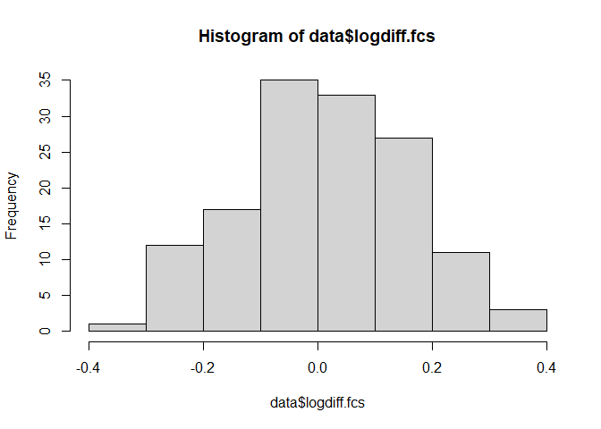

A Generalized Linear Model in R
================
Ariella Rink
2022-06-09

## Background

We are going to be looking at how well relative difference in hind femur
size between competing males predicts whether resident males win fights
against intruding male monkey beetles *Heterochelus chiragricus*. Fights
occur on flowers and generally start when an incoming male (the
intruder) spots a male already on the flower (the resident), guarding a
female. Males fight by wrestling with their hind legs, and I measured
several aspects of hind leg size. Here we will focus on the size of the
hind femurs.

## Reading in and cleaning the data

We’ll first read in a .csv
[file](https://github.com/ariellanr/DataAnalystPortfolio/blob/main/beetle_fights_chiragricus.csv)
containing the following variables: - fight \| an alphanumeric key
uniquely identifying each fight - dur \| duration of the fight (measured
in seconds) - res.win \| a binary variable indicating whether the
resident male won (1) or lost (0) the fight - res.f.cs \| femur size of
the resident male (cs = centroid size, a size value derived using
geometric morphometric methods) - intr.f.cs \| femur size of the
intruder male (cs = centroid size, a size value derived using geometric
morphometric methods) - logdiff.fcs \| relative difference in femur size
between resident and intruder, expressed as the difference between the
natural logarithms of each value. See [this
paper](https://www.sciencedirect.com/science/article/abs/pii/S0022249614000054)
and this [CrossValidated
thread](https://stats.stackexchange.com/questions/244199/why-is-it-that-natural-log-changes-are-percentage-changes-what-is-about-logs-th)
for more information.

Each row contains data pertaining to one contest.

``` r
data<-read.csv("beetle_fights_chiragricus.csv",header=TRUE, sep=",", na.strings="NA", dec=".", strip.white=TRUE, encoding="UTF-8")
data<-na.omit(data)
head(data)
```

    ##   fight dur res.win res.f.cs intr.f.cs  logdiff.fcs
    ## 1    A1 120       0 7.401162  7.796530 -0.052041830
    ## 2  A201   2       0 5.719088  7.079838 -0.213441717
    ## 3  A202  60       0 7.216150  7.264181 -0.006633985
    ## 4  A203  30       0 4.960003  6.674864 -0.296942443
    ## 5  A204  20       0 7.009814  8.142722 -0.149813395
    ## 6  A205 120       0 5.941225  6.696879 -0.119726256

## Exploring the data

We are interested in modelling `res.win` as a function of `logdiff.fcs`.
Let’s have a look at `logdiff.fcs` and also the actual femur size of
each competitor, `res.f.cs` and `intr.f.cs`.

``` r
hist(data$res.f.cs)
```

<!-- -->

``` r
hist(data$intr.f.cs)
```

<!-- -->

``` r
hist(data$logdiff.fcs)
```

<!-- -->

Each variable looks more or less normally distributed. Let’s do a
Shapiro-Wilk test of normality on each to check.

``` r
shapiro.test(data$res.f.cs)
```

    ## 
    ##  Shapiro-Wilk normality test
    ## 
    ## data:  data$res.f.cs
    ## W = 0.9811, p-value = 0.0513

``` r
shapiro.test(data$intr.f.cs)
```

    ## 
    ##  Shapiro-Wilk normality test
    ## 
    ## data:  data$intr.f.cs
    ## W = 0.99205, p-value = 0.6267

``` r
shapiro.test(data$logdiff.fcs)
```

    ## 
    ##  Shapiro-Wilk normality test
    ## 
    ## data:  data$logdiff.fcs
    ## W = 0.99555, p-value = 0.9489

Great! All three tests return p-values of \>0.05, which means that the
alternative hypothesis of non-normal distribution is not supported i.e.,
we can assume that these variables are normally distributed.

## The model

Our dependent variable (`res.win`) is binary, which suits our data to
being explored using a generalized linear model with family set to
binomial. Different families can be specified depending on the structure
of the data.

``` r
win.femsize<-glm(res.win~logdiff.fcs,family=binomial(logit),data=data)
summary(win.femsize)
```

    ## 
    ## Call:
    ## glm(formula = res.win ~ logdiff.fcs, family = binomial(logit), 
    ##     data = data)
    ## 
    ## Deviance Residuals: 
    ##     Min       1Q   Median       3Q      Max  
    ## -2.4187  -0.6879   0.3767   0.7110   1.9445  
    ## 
    ## Coefficients:
    ##             Estimate Std. Error z value Pr(>|z|)    
    ## (Intercept)   1.0648     0.2369   4.495 6.96e-06 ***
    ## logdiff.fcs  10.7889     2.0363   5.298 1.17e-07 ***
    ## ---
    ## Signif. codes:  0 '***' 0.001 '**' 0.01 '*' 0.05 '.' 0.1 ' ' 1
    ## 
    ## (Dispersion parameter for binomial family taken to be 1)
    ## 
    ##     Null deviance: 168.62  on 138  degrees of freedom
    ## Residual deviance: 124.04  on 137  degrees of freedom
    ## AIC: 128.04
    ## 
    ## Number of Fisher Scoring iterations: 5

Looking at the summary of the model output, we can see that the larger
the relative difference between the resident and intruders’ femur sizes,
the more likely the resident is to win. Bigger legs = good for fighting
beetles!

## Let’s visualise this and run some predictions

``` r
plot(data$res.win~data$logdiff.fcs,main="",ylab="Probability of resident winning",xlab="Relative difference in femur centroid size",las=1)
x <- seq(-0.3588946, 0.3938675, length = 131)
y <- predict(win.femsize, data.frame(logdiff.fcs=x),type="response")
lines(x,y)

# Calculate standard error for our prediction...
y.se<-predict(win.femsize, data.frame(logdiff.fcs=x),type="response",se.fit=T)
UL<- y + y.se$se.fit*1.96
LL<- y - y.se$se.fit*1.96

# Shade in the area encompassing the standard error...
par(new=TRUE)
polygon(c(rev(x),x),c(rev(UL),LL),col=rgb(0.5,0.5,0.5,0.2),border=F)

# Add a legend...
legend(0.1,0.3, legend=c("Intercept","Equal probability"),lty=c(2,3),bty="n")

# Intercept line to highlight probability of resident winning when there is no difference in femur size between him and his opponent
yval<-predict(win.femsize,data.frame(logdiff.fcs=0),type="resp")
xmin<-min(data$logdiff.fcs)
clip(x1=xmin,x2=0,y1=0,y2=yval)
abline(h=yval,v=0,lty=2)

# What is the size difference at which either opponent is equally likely to win?
findInt <- function(model, value) {
  function(x) {
    predict(model, data.frame(logdiff.fcs=x), type="response") - value
  }
}
equal<-uniroot(findInt(win.femsize, .5), range(data$logdiff.fcs))$root
equal
```

    ## [1] -0.09870349

``` r
# Let's plot this...
clip(x1=xmin,x2=equal,y1=0,y2=0.5)
abline(h=0.5,v=equal,lty=3)
```

<!-- -->

Opponents are equally likely to win when the relative log difference
between intruder and resident femur size is \~9.87%. As an example, take
a resident male with femur size = 5. In order for an intruder to be as
likely as this resident to win a contest, the intruder will need to have
femurs of size:

``` r
5*exp(-equal)
```

    ## [1] 5.518695

And if both contestants have the same femur size (i.e. relative
difference in femur size = 0), then the oods that the resident male will
win are:

``` r
exp(coefficients(win.femsize))[1]
```

    ## (Intercept) 
    ##     2.90018

Which means that the resident is approximately 2.90 times more likely
than the intruder to win a size-matched contest.
